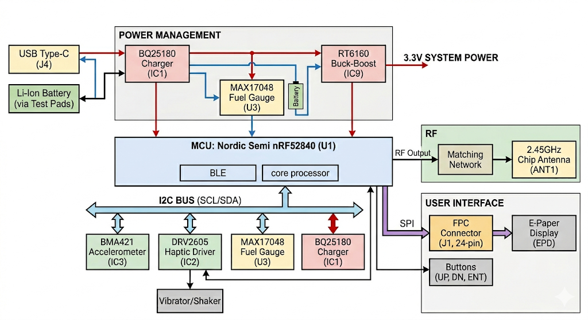

# Proiect Hector Watch - nRF52840 Smartwatch

Acest document conține specificațiile tehnice, Bill of Materials (BOM) și detaliile de design pentru proiectul Hector Watch.

---

# 1. Diagramă Bloc

---

# 2. Bill Of Materials (BOM)

## Bill of Materials (BOM) - Lista Completă de Componente

| Cant. | Referințe | Valoare | Descriere Tehnică | Producător | Cod Piesă (MPN) |
|:---:|:---|:---|:---|:---|:---|
| 1 | U1 | nRF52840 | [cite_start]Microcontroller Bluetooth LE, AQFN-73 [cite: 5] | Nordic Semi | nRF52840-QIAA |
| 1 | IC1 | BQ25180 | [cite_start]Charger Li-Ion/Polymer, 8-DSBGA [cite: 3, 4] | Texas Instr. | BQ25180YBGR |
| 1 | IC2 | DRV2605 | [cite_start]Driver Haptic LRA/ERM, 9-DSBGA [cite: 3, 4] | Texas Instr. | DRV2605YZFR |
| 1 | IC3 | BMA421 | [cite_start]Accelerometru Triaxial 12-bit [cite: 3] | Bosch | BMA423 |
| 1 | IC9 | RT6160 | [cite_start]Buck-Boost DC-DC Controller, 15-WL-CSP [cite: 5] | Richtek | RT6160AWSC |
| 1 | U3 | MAX17048 | [cite_start]Fuel Gauge (Monitorizare Baterie) [cite: 4] | Maxim/ADI | MAX17048G+T10 |
| 1 | ANT1 | 2.45GHz | [cite_start]Antenă Chip Ceramică [cite: 1] | Johanson | 2450AT18B100E |
| 1 | J4 | USB-C | [cite_start]Conector USB Type-C 16 pini [cite: 4] | Kinghelm | KH-TYPE-C-16P |
| 1 | J1 | FPC 24 | [cite_start]Conector FFC/FPC 0.5mm, 24 pini  | Molex | 503480-2400 |
| 1 | J2 | TC2030 | [cite_start]Interfață programare Tag-Connect [cite: 5] | Tag-Connect | TC2030-IDC |
| 3 | SW_DN, SW_ENT, SW_UP | Tactile | [cite_start]Butoane navigare interfață [cite: 1] | Panasonic | EVP-AKE31A |
| 1 | L5 | 68uH | [cite_start]Inductor putere ecranat [cite: 3] | Wurth | 744043680 |
| 1 | L4 | 0.47uH | [cite_start]Inductor SMD [cite: 4] | TDK | FTC252012SR47MBCA |
| 1 | L2 | 10uH | [cite_start]Inductor generic 0402 [cite: 1] | - | - |
| 1 | L3 | 15nH | [cite_start]Inductor generic 0201 [cite: 1] | - | - |
| 1 | L1 | 3.9nH | [cite_start]Inductor generic 0201  | - | - |
| 1 | X1 | 32MHz | [cite_start]Cristal cuarț (Main Clock)  | - | - |
| 1 | X2 | 32.768kHz | [cite_start]Cristal cuarț (RTC Clock)  | - | - |
| 3 | D2, D4, D5 | MBR0530 | [cite_start]Diodă Schottky 0.5A, 30V, SOD-123 [cite: 4] | ON Semi | MBR0530 |
| 1 | D3 | USBLC6-2 | [cite_start]Protecție ESD USB, SOT-23-6 [cite: 4] | ST Micro | USBLC6-2SC6Y |
| 1 | Q1 | P-Ch | [cite_start]Tranzistor P-channel MOSFET [cite: 4] | - | - |
| 1 | Q3 | N-Ch | [cite_start]Tranzistor N-channel MOSFET 30V, 1.5A [cite: 4] | Vishay | Si1308EDL |
| 6 | R2_EP_DR, R5-R9, R_PWR | 10K | [cite_start]Rezistență 0201 Thin Film [cite: 1] | - | - |
| 2 | R1_USB, R2_USB | 5K1 | [cite_start]Rezistență 0201 Thin Film  | - | - |
| 2 | R17, R18 | 3K3 | [cite_start]Rezistență 0201 Thin Film  | - | - |
| 3 | R2, R3, R4 | 0 | [cite_start]Rezistență 0201 (Jumper/0 Ohm) [cite: 1] | - | - |
| 6 | C5-C19 | 100nF | [cite_start]Condensator decuplare 0201 [cite: 1] | - | - |
| 9 | EPD_C1-C12 | 1uF/50V | [cite_start]Condensator 0402 [cite: 1] | - | - |
| 5 | C6, C14, C20, C21, C43 | 4.7uF | [cite_start]Condensator 0402  | - | - |
| 3 | C1-EP-DR, C24, C39 | 10uF | [cite_start]Condensator 0402 [cite: 1] | - | - |
| 2 | C25, C33 | 22uF | [cite_start]Condensator 0402 [cite: 1] | - | - |
| 4 | C23, C27, C34, C42 | 0.1uF | [cite_start]Condensator 0201 [cite: 1] | - | - |
| 4 | C1, C2, C17, C18 | 12pF | [cite_start]Condensator 0201 [cite: 1] | - | - |
| 14 | TP_3.3V ... TP_VREG | Test Pad | [cite_start]Puncte de testare semnale [cite: 4] | - | - |
| 1 | SJ1 | Solder | [cite_start]Jumper de lipit SMD [cite: 1] | - | - |

---

# 3. Funcționalitate Hardware
### Module și Interfețe
## Descrierea Detaliată a Funcționalității Hardware

Descrierea Detaliată a Funcționalității Hardware

Proiectul Hector Watch utilizează o arhitectură modulară optimizată pentru eficiență energetică și dimensiuni reduse, având la bază următoarele componente principale:

### 1. Unitatea Centrală de Procesare (MCU)
* **nRF52840 (U1)**: Acesta este un System-on-Chip (SoC) avansat care rulează logica principală a ceasului și gestionează stack-ul Bluetooth Low Energy.
* **Rol**: Controlează comunicația cu toți senzorii prin magistrala **I2C** și interfața digitală pentru display.

### 2. Managementul Puterii (Power Management)
Sistemul de alimentare este proiectat pentru a asigura stabilitate și longevitate bateriei Li-Ion:
* **Încărcător BQ25180 (IC1)**: Gestionează procesul de încărcare a bateriei via USB și include protecții integrate pentru celula de litiu.
* **Regulator Buck-Boost RT6160 (IC9)**: Un convertor DC-DC care stabilizează tensiunea de sistem la 3.3V, indiferent de variațiile tensiunii bateriei.
* **Monitor Baterie MAX17048 (U3)**: Un circuit de tip "Fuel Gauge" care utilizează algoritmul ModelGauge pentru a raporta precis starea de încărcare a bateriei.

## Analiza Consumului de Energie și Autonomie

[cite_start]Pentru a estima durata de viață a bateriei, am analizat principalele stări de funcționare ale componentelor identificate în BOM[cite: 1]:

### 1. Consum pe Module (Estimativ)

| Modul / Componentă | Deep Sleep / Standby | Operare Activă (Typical) |
| :--- | :--- | :--- |
| **nRF52840 (U1)** | ~1.5 µA (RTC ON) | ~4.8 mA (TX @ 0dBm) |
| **BMA421 (IC3)** | ~1 µA (Suspend) | ~14.5 µA (Low Power) |
| **MAX17048 (U3)** | ~3 µA (Hibernate) | ~23 µA (Activ) |
| **RT6160 (IC9)** | ~1 µA (Iq) | Eficiență >85% |
| **Display E-Paper** | **0 µA** (Static) | ~2-8 mA (Refresh doar) |

### 2. Scenariu de Utilizare Tipic
Consumul mediu este calculat pe baza unui ciclu de funcționare (Duty Cycle) în care dispozitivul petrece 99% din timp în mod Sleep:

* [cite_start]**Consum în Sleep (Sistem complet):** ~20 µA (micro-Amperi).
* [cite_start]**Consum în Activitate (Scurte pulsații):** ~5-10 mA (mili-Amperi).
* **Consum Mediu Estimat:** **~55 µA**.

## Calcul Autonomie
Considerând o baterie Li-Ion standard de **200 mAh**:

$$Autonomie (ore) = \frac{Capacitate (mAh)}{Consum Mediu (mA)}$$

$$Autonomie = \frac{200 mAh}{0.055 mA} \approx 3636 \text{ ore}$$

**Rezultat:** Dispozitivul poate funcționa teoretic aproximativ **5 luni** cu o singură încărcare în regim de standby/notificări ocazionale. Utilizarea intensă a motorului haptic (DRV2605) sau refresh-ul frecvent al ecranului va reduce această perioadă la aproximativ **2-4 săptămâni**.

### 3. Senzori și Feedback Haptic
* **Accelerometru BMA421/BMA423 (IC3)**: Senzor de mișcare triaxial cu consum ultra-redus, utilizat pentru pedometru și detecția gesturilor de ridicare a mâinii.
* **Driver Haptic DRV2605 (IC2)**: Controller specializat pentru motoare de vibrație (ERM/LRA) ce oferă o bibliotecă internă de efecte tactile complexe.

### 4. Interfețe și Comunicație
* **Antenă Chip 2.45GHz (ANT1)**: Componentă ceramică acordată pentru frecvența Bluetooth, esențială pentru conexiunea wireless.
* **Conector FPC J1 (24 pini)**: Interfață de 0.5mm utilizată pentru conectarea panoului de afișaj E-Paper.
* **Port USB Type-C (J4)**: Punctul principal de alimentare și încărcare a dispozitivului.
* **Butoane (SW_UP, SW_DN, SW_ENT)**: Trei switch-uri tactice pentru navigarea utilizatorului în meniurile ceasului.

### 5. Protecție și Componente Pasive
* **Protecție ESD USBLC6-2SC6Y (D3)**: Protejează pinii de date USB împotriva descărcărilor electrostatice.
* [cite_start]**Diodă Schottky MBR0530 (D2, D4, D5)**: Componente utilizate pentru redresare și protecția căilor de alimentare.
* [cite_start]**Filtrare locală**: Sistemul utilizează o rețea densă de condensatoare de decuplare (majoritatea în capsulă 0201) pentru a reduce zgomotul electric pe liniile de alimentare.
---

# 4. Alocare Pini nRF52840
# nRF52840 – Conectarea pinilor

## 1. Alimentare și stabilizare

### Pini implicați

* VDD, VDDH
* DEC1, DEC3, DEC4, DEC5, DEC6
* DCC, DCCHP
* VSS (GND)

### Conectare

* VDD este conectat la 3.3V
* VDDH este conectat la sursa principală (baterie sau regulator)
* Pinii DEC sunt conectați la condensatori (100nF, 1µF, 4.7µF) către masă
* DCC și DCCHP sunt conectați la inductoare pentru convertorul DC/DC

### Motivație

* Asigură stabilitatea tensiunilor interne
* Reduce zgomotul electric
* Permite funcționarea eficientă energetic prin utilizarea convertorului DC/DC intern

---

## 2. Interfața RF (2.4 GHz)

### Pini implicați

* ANT
* VSS_PA

### Conectare

* ANT este conectat la o rețea de adaptare (matching network) formată din inductoare și condensatori
* Rețeaua este conectată la antenă

### Motivație

* Adaptarea impedanței la 50 ohmi
* Maximizarea puterii semnalului emis
* Creșterea sensibilității la recepție

---

## 3. Oscilatoare (ceas)

### Pini implicați

* P0.00 (XL1)
* P0.01 (XL2)
* XC1, XC2

### Conectare

* Cristal de 32.768 kHz cu condensatori de 12pF
* Cristal de 32.768 MHz

### Motivație

* Ceasul de 32 kHz este utilizat pentru RTC și moduri low-power
* Ceasul de mare frecvență este necesar pentru comunicații radio precise

---

## 4. Debug și programare (SWD)

### Pini implicați

* SWDIO
* SWDCLK
* RESET
* SWO (opțional)

### Conectare

* Conectați la un header de programare (TC2030)
* Expuse și prin puncte de test

### Motivație

* Programarea firmware-ului
* Debugging în timpul dezvoltării

---

## 5. Interfață USB

### Pini implicați

* D+
* D-
* VBUS

### Conectare

* Conectați la conector USB-C
* Include protecție ESD

### Motivație

* Comunicație USB cu alte dispozitive
* Posibilitate de alimentare prin USB

---

## 6. Interfață SPI – Display E-Paper

### Pini implicați

* MOSI
* SCK
* EPD_CS
* EPD_DC
* EPD_RST
* EPD_BUSY

### Conectare

* Conectați la conectorul display-ului și circuitul de comandă

### Motivație

* SPI oferă comunicație rapidă
* Liniile suplimentare controlează funcționarea display-ului (comenzi, reset, status)

---

## 7. Interfață I2C

### Pini implicați

* SDA
* SCL

### Conectare

* Conectați la:

  * IMU (accelerometru)
  * Fuel gauge
  * Driver haptic
* Include rezistențe de pull-up (~3.3kΩ)

### Motivație

* Permite conectarea mai multor dispozitive pe aceeași magistrală
* Reduce numărul de pini necesari

---

## 8. GPIO și semnale de întrerupere

### Exemple de semnale

* IMU_INT1, IMU_INT2
* PMIC_INT
* HAPTIC_EN
* Butoane

### Conectare

* Intrări/ieșiri digitale configurabile

### Motivație

* Gestionarea evenimentelor asincrone
* Permite funcționare eficientă energetic (bazată pe întreruperi)

---

## 9. Alimentare externă și baterie

### Conectare

* VBUS → USB
* VBAT → baterie LiPo
* Conectate la:

  * Circuit de încărcare
  * Circuit de monitorizare (fuel gauge)

### Motivație

* Management complet al energiei
* Separarea funcțiilor de alimentare și monitorizare

